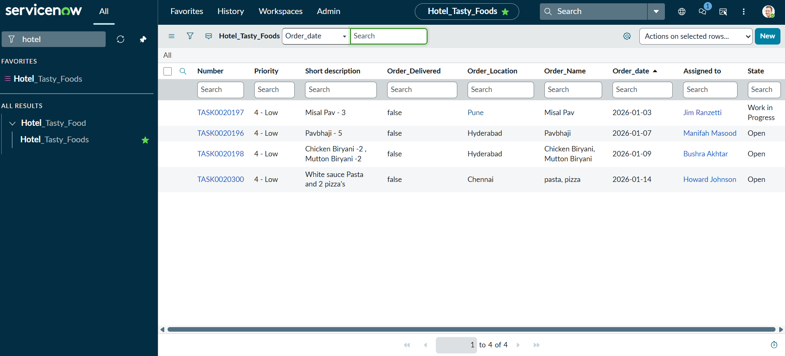

# Custom ServiceNow Table & Platform Configuration

# Overview:
This project focuses on understanding and configuring the ServiceNow platform basics such as tables, forms and fields. 
A custom table was created to model a non-IT business workflow, allowing hands-on practice with table design, form configuration, and data handling within the ServiceNow ecosystem.

# Objectives:
1. To explore ServiceNow platform flexibility beyond standard ITSM use cases.
2. To gain hands-on experience with custom table creation and configuration.
3. To understand form layouts, field types, and data lifecycle behavior

# Key Features
1. Created a custom ServiceNow table to represent a non-IT business-specific workflow.
2. Created and configured custom fields with appropriate data types.
3. Designed and customized forms for data entry of customers and readability.
4. Tested record creation, updates, and lifecycle behavior in PDI.

# Technologies Used
1. ServiceNow Platform
2. Platform Configuration
3. Form & Table Design

# Key Learnings
1. Understanding of ServiceNow table architecture and customization.
2. Differences between standard ITSM tables and custom tables.
3. Practical experience with form layouts and data modeling.
4. Improved familiarity with ServiceNow platform capabilities.

# ServiceNow PDI Screenshots:
1. Custom Table:

2. Custom Form and Fields:

# Notes
This project was built as a learning-focused exercise to strengthen core ServiceNow platform concepts and configuration skills.
